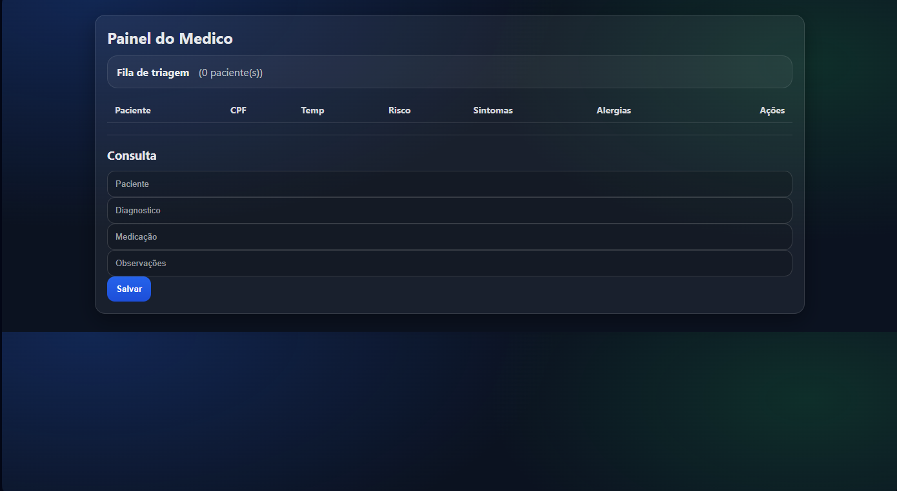
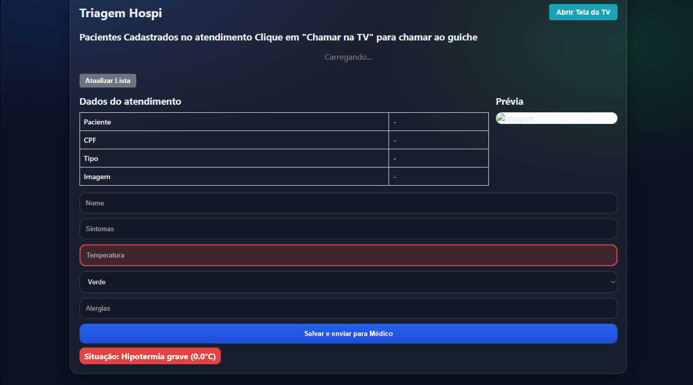

# ❤️ Projeto Sentinela

> Sistema hospitalar de cardiologia para gestão clínica, operacional e de acompanhamento de pacientes.

O projeto foi mantido funcional e passou por uma refatoração para corrigir arquitetura, navegação, controle de acesso e consistência de dados.

[](https://projeto-sentinela-rwir.onrender.com)
[](https://nodejs.org)
[](https://expressjs.com)
[](https://www.postgresql.org)
[](LICENSE)

---

## Acesso online ao projeto

O sistema está publicado e disponível para uso imediato:

### ➡️ [https://projeto-sentinela-rwir.onrender.com](https://projeto-sentinela-rwir.onrender.com)

- Entre com um usuário de demonstração (exemplo: `admin` / `123`) — veja a tabela [abaixo](#usuários-de-demonstração)
- No plano gratuito do Render, a primeira requisição após um período de inatividade pode levar alguns segundos enquanto o serviço "acorda"
- O tutorial completo abaixo vale tanto para a versão online quanto para o ambiente local

## Sumário

- [Acesso online ao projeto](#acesso-online-ao-projeto)
- [Visão geral](#visão-geral)
- [Screenshots](#screenshots)
- [Tecnologias](#tecnologias)
- [Safety Engine e IA (Gemini)](#safety-engine-e-ia-gemini)
- [Estado atual do projeto](#estado-atual-do-projeto)
- [Como rodar localmente](#como-rodar-localmente)
- [Estrutura principal](#estrutura-principal)
- [Usuários de demonstração](#usuários-de-demonstração)
- [Fluxo principal do sistema](#fluxo-principal-do-sistema)
- [Tutorial completo de uso do Sentinela](#tutorial-completo-de-uso-do-sentinela)
- [Segurança e autenticação](#segurança-e-autenticação)
- [Observações importantes](#observações-importantes)
- [Dicas de uso em demonstração](#dicas-de-uso-em-demonstração)
- [Próximos passos sugeridos](#próximos-passos-sugeridos)
- [Licença](#licença)

## Visão geral

O Sentinela reúne os principais fluxos de um hospital de cardiologia:

- Atendimento inicial do paciente
- Triagem clínica com priorização
- Consultas médicas
- Exames e laudos
- Prescrições e farmácia
- Estoque categorizado de medicamentos cardiológicos
- Atendimento domiciliar / acompanhamento em casa
- Alertas, auditoria, relatórios e apoio da IA

## Screenshots

| Painel do médico | Triagem |
|---|---|
|  |  |

## Tecnologias

| Camada | Tecnologia |
|---|---|
| Backend | Node.js + Express 5, sessões em cookie HTTP-only, RBAC |
| Frontend | HTML, CSS e JavaScript puros (layout global em `frontend/layout.js`) |
| Persistência | JSON local (`backend/db.json`) para demonstração; PostgreSQL via `DATABASE_URL` em produção |
| Deploy | [Render](https://projeto-sentinela-rwir.onrender.com) |
| IA | **Google Gemini** (`gemini-3.6-flash`) via **Sentinela AI** — veja [Safety Engine e IA](#safety-engine-e-ia-gemini) |

## Safety Engine e IA (Gemini)

O **Safety Engine** é o motor de segurança clínica do Sentinela. Em cada etapa do fluxo ele analisa os registros do paciente (triagem + prescrição) e **aponta possíveis inconsistências** que exigem revisão do profissional. Ele **não diagnostica e não prescreve** — a decisão clínica continua sendo sempre do médico.

Sobre esse motor roda a camada de **IA generativa** (**Sentinela AI**, integrada à **Google Gemini**), que lê o prontuário, produz um resumo clínico objetivo e destaca inconsistências em texto — também apenas como apoio à decisão.

### Pipeline completo

```text
Triagem (POST /triagem)
  │  sinais cardiológicos críticos → alerta ALTO (regra: sinal_cardio)
  ▼
Consulta médica (frontend/medico.html → página "Consultas")
  │  botão "🔍 Verificar segurança" → POST /safety/preview → safetyCheck()  (prévia)
  ▼
POST /consulta → safetyCheck() → achados [CRITICO | ALTO | ATENCAO]
  │                                  │
  │                                  └─ registrarAlerta() → db.alertas (máx. 500)
  ▼
GET /ia/resumo/:cpf → resumoIA() → Gemini (endpoint OpenAI-compatível)
                                     └─ sem chave/erro → resumo local determinístico
```

### Regras determinísticas (`safetyCheck()`)

Implementadas em `backend/server.js` (`safetyCheck`, ~linha 234) e aplicadas em **toda** consulta e na prévia do Safety Engine:

| Regra | Nível | Gatilho | Mensagem ao profissional |
|---|---|---|---|
| `alergia` | **CRITICO** | termo da alergia registrada na triagem aparece na medicação prescrita | "Possível conflito com alergia registrada. Revisão obrigatória antes de dispensar." |
| `alto_risco` | ALTO | medicação do protocolo cardiológico de alto risco (`varfarina`, `rivaroxabana`, `apixabana`, `dabigatrana`, `edoxabana`, `heparina`, `enoxaparina`, `clopidogrel`, `ticagrelor`, `amiodarona`, `digoxina`, `insulina`) | "Medicamento de alto risco (protocolo cardiológico). Confirmar dose, indicação registrada e monitoramento." |
| `duplicidade` | ATENCAO | mesma medicação já registrada em consulta anterior do paciente | "Medicação já registrada para este paciente. Verificar se é continuidade ou duplicidade." |
| `dados_incompletos` | ATENCAO | prescrição sem diagnóstico e/ou sem medicação | "Prescrição com informação obrigatória ausente (diagnóstico/medicação)." |
| `sinal_critico` | ALTO | temperatura ≥ 39 °C ou < 35 °C | "Sinal registrado exige avaliação clínica imediata." |

Na **triagem**, os sinais cardiológicos também elevam a prioridade para `vermelho` e disparam um alerta `sinal_cardio` (nível ALTO): PA ≥ 180 ou ≤ 90 mmHg, PAD ≥ 110 mmHg, FC ≥ 110 ou ≤ 45 bpm, SpO2 < 94%, dor torácica, falta de ar ou desmaio.

### Camada de IA — Sentinela AI + Gemini

`resumoIA()` (`backend/server.js`, ~linha 626) chama a Gemini pelo **endpoint oficial OpenAI-compatível**:

| Item | Valor padrão |
|---|---|
| Endpoint | `https://generativelanguage.googleapis.com/v1beta/openai/chat/completions` (`AI_API_URL`) |
| Modelo | `gemini-3.6-flash` (`AI_MODEL`) |
| Autenticação | `Authorization: Bearer <GEMINI_API_KEY>` |
| Temperatura / saída | `0.2` / máximo de `350` tokens |

O *system prompt* obriga a IA a **não diagnosticar, não prescrever, não inventar, não repetir informação, priorizar registros recentes e responder em português brasileiro** (~100 palavras), devolvendo **somente JSON**:

```json
{
  "resumo": "Resumo objetivo.",
  "inconsistencias": ["Inconsistência relevante."]
}
```

### Racionamento de tokens e custo

`resumoIA()` foi desenhado para gastar o mínimo de tokens:

- **Contexto compacto:** apenas os 3 últimos registros de triagem, 4 de consulta e 2 de atendimento, só com campos clínicos permitidos e textos truncados em 300 caracteres (limite de 12.000 caracteres de entrada)
- **Cache de resposta:** 5 minutos por paciente/contexto (até 100 entradas) — evita repetir a chamada para o mesmo prontuário
- **Rate limit:** 10 requisições por janela de 10 minutos, por usuário
- **Saída limitada:** 350 tokens

### Fallback — a IA é opcional e nunca quebra o fluxo

Se não houver `GEMINI_API_KEY`, se a cota estourar, se o HTTP falhar, se o JSON voltar inválido ou a resposta vier vazia, o endpoint devolve o **resumo local determinístico** (`buildLocalClinicalSummary`) com `origem: "local"`, `iaDisponivel: false` e `erroIA` explicando o motivo. Na interface isso aparece como:

- `● Gemini conectado` → a IA respondeu
- `⚠ Resumo local` → foi usado o fallback
- `Resultado reutilizado do cache` → resposta reaproveitada

### Endpoints do módulo

| Método | Rota | Perfil | Função |
|---|---|---|---|
| `GET` | `/safety/regras` | autenticado | Lê as regras configuradas do Safety Engine |
| `PUT` | `/safety/regras` | médico / cardiologista | Salva as flags e audita como `safety_regras_atualizadas` |
| `POST` | `/safety/preview` | médico / cardiologista | Prévia dos achados **antes** de confirmar a prescrição |
| `GET` | `/ia/resumo/:cpf` | médico / cardiologista | Resumo clínico (Gemini, com fallback local) + inconsistências |
| `GET` | `/alertas` | médico, cardiologista, triagem, enfermagem | Ocorrências (`?nivel=CRITICO`, `?abertos=1`) |
| `POST` | `/alertas/:id/resolver` | médico, cardiologista, direção | Marca a ocorrência como revisada |
| `GET` | `/auditoria` | médico, cardiologista, direção, admin | Trilha de ações (últimos 200 eventos) |

### Como habilitar a IA (local e Render)

1. Gere uma chave de API no Google AI Studio (Gemini).
2. Configure no `.env` local ou nas *Environment Variables* do Render:

```env
GEMINI_API_KEY=sua_chave_aqui
AI_API_URL=https://generativelanguage.googleapis.com/v1beta/openai/chat/completions
AI_MODEL=gemini-3.6-flash
```

3. Suba a aplicação. Sem a chave, o boot apenas registra o aviso:
   `Gemini API key não configurada. Configure GEMINI_API_KEY no ambiente. A integração de IA usará apenas o resumo local.`

### Onde usar na interface

- **Safety Engine** (`frontend/safety-engine.html`) — liga/desliga as regras e lista as ocorrências em aberto
- **Consultas** (`frontend/medico.html`) — `🔍 Verificar segurança` roda a prévia do Safety Engine; `🤖 Resumo IA` gera o resumo; ao salvar, os achados voltam em `alertasGerados` e aparecem no aviso
- **Alertas** (`frontend/alertas.html`) — central de ocorrências, atualizada a cada 10 segundos, com filtros por nível e botão `Revisar`
- **Sentinela AI** (`frontend/sentinela-ai.html`) — resumo assistido do prontuário, com badge indicando se a Gemini respondeu ou se foi usado o resumo local

> ⚠️ **Limitações atuais:** as flags salvas em `/safety/regras` ficam persistidas e auditadas, mas a execução atual do `safetyCheck()` aplica sempre o conjunto padrão de 5 regras (as flags ainda não filtram a execução). As inconsistências apontadas pela IA **não** geram alerta automaticamente: só o motor determinístico grava em `db.alertas`.

## Estado atual do projeto

### Fase 1
- Correção de arquitetura, sessão e navegação
- Ajuste de permissões e perfis reais por conta
- Padronização do layout global e menu lateral
- Fluxos de login, recuperação de senha e primeiro acesso revisados

### Fase 2
- Endpoints de usuários, cargos, permissões e setores
- Suporte a setor no cadastro de profissionais
- Melhor organização da gestão administrativa

### Fase 3
- Fluxos de exames, farmácia, alertas e Safety Engine preservados
- Modo claro/escuro por usuário (botão no cabeçalho, preferência salva na conta)
- Melhorias de UX e visual institucional
- Expansão para atendimento domiciliar
- Estoque organizado por categoria clínica

## Como rodar localmente

```bash
npm install
npm start
```

A aplicação fica disponível em:

```text
http://localhost:3000
```

> Prefere não instalar nada? Use a versão publicada: **[https://projeto-sentinela-rwir.onrender.com](https://projeto-sentinela-rwir.onrender.com)**

Dica: com o servidor no ar, `npm test` executa um smoke test rápido (`scripts/smoke-test.js`), que valida login, sessão, dashboard, estoque e atendimento domiciliar.

## Estrutura principal

- `backend/server.js` — autenticação, autorização, APIs e fluxo clínico
- `backend/src/db.js` — camada de persistência e permissões RBAC
- `backend/db.json` — dados locais de demonstração
- `frontend/layout.js` — layout global e menu lateral
- `frontend/styles.css` — identidade visual do sistema
- `frontend/atendimento-casa.html` — módulo de atendimento domiciliar
- `database.sql` — schema ÚNICO do PostgreSQL (tabelas + seeds + índices). Execute só ele.
- `database/seeds.sql` — seed de usuários de demonstração (executar só se o banco estiver vazio)
- `database/migrate-json-to-postgres.js` — migração do JSON para PostgreSQL

## Usuários de demonstração

O ambiente local atual utiliza o arquivo `backend/db.json` e já contém usuários de teste. A lista completa de credenciais, cargos e permissões RBAC está em [`docs/CREDENCIALES.md`](docs/CREDENCIALES.md).

> Os mesmos usuários podem ser usados na [versão online](https://projeto-sentinela-rwir.onrender.com), que parte da mesma base de demonstração.

### Usuários ativos

| Usuário | Senha | Perfil |
|---|---|---|
| `admin` | `123` | administrador |
| `atendimento` | `123` | atendimento |
| `triagem` | `123` | triagem |
| `medico` | `123` | médico |
| `novo.setor` | `trocar_no_primeiro_acesso` | triagem (setor UTI) |

> O usuário `novo.setor` é um exemplo de primeiro acesso: ele precisa trocar a senha ao entrar pela primeira vez.

## Fluxo principal do sistema

1. Faça login com um usuário demo
2. O dashboard carrega conforme o perfil da conta
3. Use o módulo de atendimento para registrar o paciente
4. A triagem avalia sinais e prioridade
5. O médico realiza a consulta — o [Safety Engine](#safety-engine-e-ia-gemini) aponta inconsistências antes de salvar e o Sentinela AI resume o prontuário
6. Os exames, prescrições, farmácia e alertas seguem o fluxo clínico
7. O setor administrativo pode consultar relatórios e auditoria

## Tutorial completo de uso do Sentinela

### 1. Acessar o sistema

- **Versão online:** abra [https://projeto-sentinela-rwir.onrender.com](https://projeto-sentinela-rwir.onrender.com)
- **Ambiente local:** abra `http://localhost:3000` após rodar `npm start`
- Use um usuário demo da tabela acima
- Exemplo: `admin / 123`

### 2. Fazer login

- No campo `usuario`, informe o login do usuário
- No campo `senha`, informe a senha correspondente
- A sessão é validada pelo backend e o menu lateral é montado conforme as permissões do perfil

### 3. Navegar pela interface

O sistema tem uma navegação por módulos:

- Dashboard
- Pacientes
- Atendimento
- Atendimento Domiciliar
- Triagem
- Consultas
- Prontuários
- Exames
- Farmácia
- Estoque
- Alertas
- Safety Engine
- Relatórios
- Auditoria

### 4. Fluxo de atendimento hospitalar

#### Atendimento inicial
- Acesse `Atendimento`
- Preencha nome, CPF, dados complementares e perfil cardiovascular
- Envie a foto, se necessário
- Clique em `Enviar para triagem`

#### Triagem
- Acesse `Triagem`
- Informe sinais vitais, sintomas e níveis de risco
- O sistema calcula prioridade e pode gerar alertas clínicos

#### Consulta médica
- Acesse `Consultas`
- Selecione o paciente
- Registre diagnóstico, medicação e observações
- O Safety Engine valida prescrições e aponta inconsistências

#### Exames e laudos
- Acesse `Exames`
- Solicite exames e acompanhe laudos
- O resultado pode ser consultado pelo médico e pelo time clínico

### 5. Fluxo de farmácia e estoque

- Acesse `Farmácia` para visualizar prescrições pendentes
- Acesse `Estoque` para acompanhar medicamentos e insumos
- O estoque já vem organizado por categoria clínica, como:
  - Antiagregantes plaquetários
  - Antiarrítmicos
  - Anticoagulantes
  - Betabloqueadores
  - Diuréticos
  - Estatinas
  - Nitratos

### 6. Fluxo de atendimento domiciliar

O Sentinela agora também oferece suporte para acompanhamento em casa.

#### Como usar
- Acesse `Atend. Domiciliar`
- Informe o CPF do paciente
- Preencha endereço, motivo, observações e data
- Salve o agendamento
- O registro fica listado para acompanhamento
- Quando o atendimento for concluído, o status pode ser marcado como concluído

#### Caso prático

1. O paciente recebe alta hospitalar
2. O time de atendimento cadastra o acompanhamento domiciliar
3. A equipe registra execução do atendimento em casa
4. O módulo mantém histórico clínico e operacional do acompanhamento

### 7. Alertas e segurança clínica

- Acesse `Alertas` para visualizar eventos críticos
- Acesse `Safety Engine` para revisar/ligar as regras e ver as ocorrências em aberto
- O Safety Engine aponta riscos e inconsistências clínico-operacionais (detalhes em [Safety Engine e IA](#safety-engine-e-ia-gemini))
- A auditoria registra ações e acessos importantes

### 8. IA do Sentinela (Gemini)

- Acesse `Sentinela AI` ou use `🤖 Resumo IA` na tela de `Consultas`
- O sistema gera um resumo do prontuário para apoio à decisão usando a **Google Gemini**
- Sem `GEMINI_API_KEY`, o endpoint cai automaticamente no resumo local por regras (badge `⚠ Resumo local`)
- A IA não substitui avaliação clínica; apenas auxilia a revisão do profissional
- Configuração da chave e detalhes técnicos: [Safety Engine e IA](#safety-engine-e-ia-gemini)

## Segurança e autenticação

- O backend valida usuário, sessão, perfil e permissões
- O login não depende do frontend para decidir o cargo
- Sessões são controladas em cookie HTTP-only
- A aplicação aceita JSON local e também pode operar com PostgreSQL quando `DATABASE_URL` estiver configurado
- Ações sensíveis (consulta criada, alerta resolvido, alteração das regras do Safety Engine, geração de resumo de IA) ficam registradas na trilha de auditoria
- A chave da Gemini (`GEMINI_API_KEY`) nunca chega ao frontend: todas as chamadas de IA partem do backend

## Observações importantes

- O sistema foi mantido funcional e não substituído por uma implementação nova
- O foco foi em correção de arquitetura, segurança e consistência operacional
- O projeto pode continuar evoluindo com melhorias de UX, relatórios e integrações reais

## Dicas de uso em demonstração

- Use `admin` para explorar todos os módulos
- Use `triagem` para testar priorização e alertas
- Use `medico` para consultar e registrar prescrições
- Use `atendimento` para registrar pacientes e agendamentos
- Use `novo.setor` para testar o primeiro acesso e redefinição de senha

## Próximos passos sugeridos

- Integrar autenticação real com e-mail institucional
- Conectar o sistema a um banco PostgreSQL em produção
- Expandir relatórios de indicadores cardiológicos
- Evoluir o módulo domiciliar com escalas, vídeos e coleta de sinais

## Licença

Distribuído sob a licença MIT. Consulte o arquivo [LICENSE](LICENSE).

---

<p align="center">
  <b><a href="https://projeto-sentinela-rwir.onrender.com">▶ Acessar o Projeto Sentinela online</a></b>
</p>
