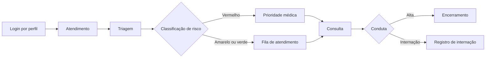

# Projeto Sentinela

O Projeto Sentinela é um sistema web de apoio ao atendimento hospitalar. Ele organiza o cadastro do paciente, a triagem, a fila médica, a consulta e a alta ou internação em um único fluxo, reduzindo perda de informação e tempo de resposta.

## Como ajuda em uma situação crítica

1. O atendimento registra o paciente e seu CPF.
2. A triagem registra sintomas, temperatura, alergias e risco.
3. A regra de prioridade destaca febre acima de 39 °C como risco vermelho e direciona o caso ao médico.
4. O médico visualiza a fila, recebe o alerta de alergia, registra a consulta e decide por alta ou internação.

O sistema apoia a decisão e a comunicação da equipe; não substitui avaliação clínica, protocolos de emergência ou acionamento imediato do serviço de urgência quando houver risco de vida.

## Fluxo principal



## Telas principais

As imagens abaixo mostram a referência visual das telas de triagem e do painel médico:


## Tecnologia e segurança

- **Backend:** Node.js, Express e SQLite3 disponível no projeto, com persistência local em JSON nesta versão.
- **Frontend:** HTML, CSS e JavaScript, servido pelo próprio backend.
- **Controles implementados:** sessões em cookie `HttpOnly` e `SameSite`, autorização por perfil, senhas migradas para `scrypt`, limite de JSON e upload, imagens restritas a JPEG/PNG/WebP, validação de CPF e campos permitidos, além de cabeçalhos HTTP de proteção.
- **Dependências:** auditadas com `npm audit`.

## Vantagens para a operação

- Um fluxo simples entre recepção, triagem e médico.
- Priorização automática de um sinal clínico relevante, sem esconder a decisão profissional.
- Alergia e dados do atendimento disponíveis no momento da consulta.
- Menos retrabalho por vínculo do atendimento ao paciente.
- Base pronta para evoluir para banco transacional, auditoria e integração com prontuário eletrônico.

## Próximos passos recomendados

Para uso real em ambiente hospitalar, ainda devem ser definidos backup e recuperação, banco transacional, trilha de auditoria imutável, HTTPS obrigatório, gestão de usuários, expiração distribuída de sessões, testes clínicos da regra de risco e adequação à LGPD. A versão atual é uma demonstração funcional e não deve ser usada como único sistema de suporte à vida.

## Execução local

```bash
npm install
npm start
```

A aplicação fica disponível em `http://localhost:3000`.