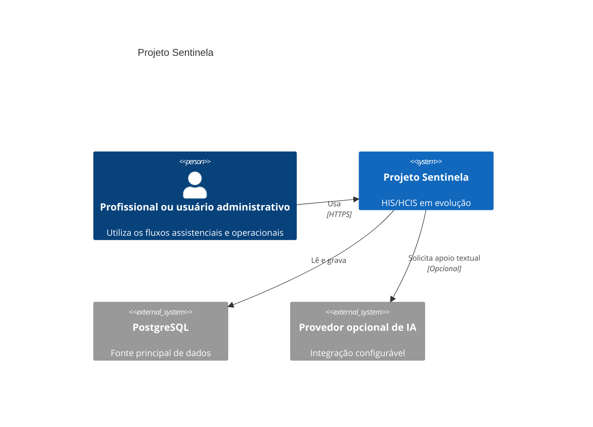
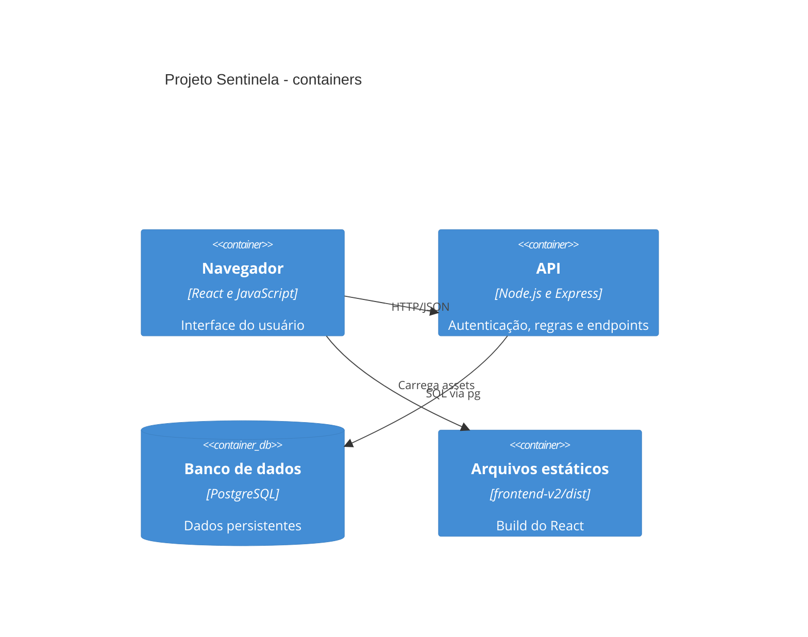

# Arquitetura

## C4 — Contexto

```mermaid
C4Context
title Projeto Sentinela
Person(user, "Profissional ou usuário administrativo", "Utiliza os fluxos assistenciais e operacionais")
System(sentinela, "Projeto Sentinela", "HIS/HCIS em evolução")
System_Ext(postgres, "PostgreSQL", "Fonte principal de dados")
System_Ext(ai, "Provedor opcional de IA", "Integração configurável")
Rel(user, sentinela, "Usa", "HTTPS")
Rel(sentinela, postgres, "Lê e grava")
Rel(sentinela, ai, "Solicita apoio textual", "Opcional")
```

## C4 — Container

```mermaid
C4Container
title Projeto Sentinela - containers
Container(browser, "Navegador", "React e JavaScript", "Interface do usuário")
Container(api, "API", "Node.js e Express", "Autenticação, regras e endpoints")
ContainerDb(db, "Banco de dados", "PostgreSQL", "Dados persistentes")
Container(files, "Arquivos estáticos", "frontend-v2/dist", "Build do React")
Rel(browser, api, "HTTP/JSON")
Rel(browser, files, "Carrega assets")
Rel(api, db, "SQL via pg")
```
